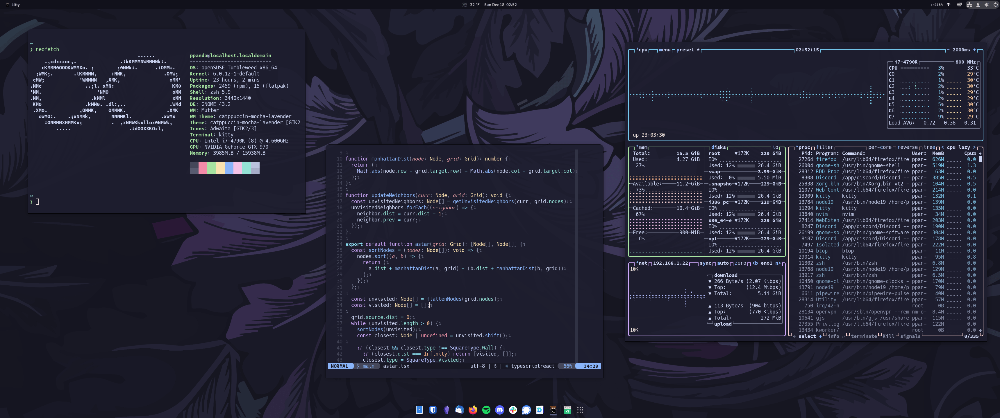

# openSUSE Tumbleweed Configurations



The goal of this project is to configure a fresh install of my openSUSE setup
as fast as possible. Scripts can be run individually or all together using
`run/run.sh`. My dotfiles are pulled from a separate repository hosted
[here](https://github.com/yuzhoumo/dotfiles). These scripts were designed with
idempotency in mind and can be re-run periodically.

## One-line interactive install

This will first run the automated setup, then guide the user through manual steps.

```
mkdir ~/opensuse-configs && cd ~/opensuse-configs && curl -#L https://github.com/yuzhoumo/opensuse-configs/tarball/main --silent | tar -xzv --strip-components 1 --exclude={README.md,LICENSE} && ./run/run.sh
```

## Documentation

### Scripts

Run scripts in the following order:

- `font.sh`: Install fonts from assets directory
- `packages.sh`: Install packages and remove unnecessary ones
- `dot.sh`: Install dotfiles from [Github](https://github.com/yuzhoumo/dotfiles)
- `gnome.sh`: Install Gnome extensions and set various tweaks/themes
- `post.sh`: Set various configurations after everything is installed
